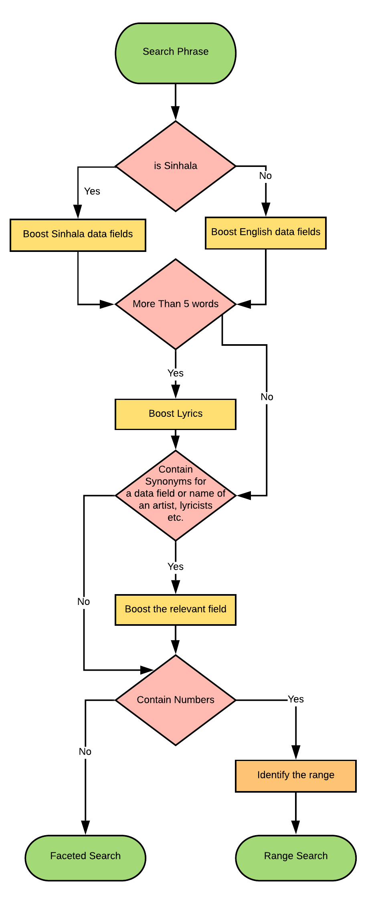

# Sinhala Songs Search Engine

This repository contains the source code for a sinhala songs search engine built using ElasticSearch and Python.

## Quickstart:
To start the search engine follow the instructions given below.
* Start an ElasticSearch Instance on the port 9200
* Run the command `python3 backend.py`
* Visit http://localhost:5000 
* Enter the search query in the search box in the website

## Directory Structure

The important files and directories of the repository is shown below
├── corpus : Original data scraped from the [website](http://sinhalasongbook.com/)  
├── translated-corpus : Data translated to Sinhala  
├── summary-corpus : Summarized data of the corpus used to create the index  
├── templates : UI related files  
├── backend.py : Flask backend of the website  
├── queries.py :  ElasticSeacrch Queries  
├── scraper.py :  Source code for the data scraper  
├── search.py : Search functions used to classify user search phrases  

## Main Functionalities

The major capabilites of the engine are listed below.

* Faceted Search – The Search Engine supports Faceted search on all the above fields
     * Eg:- Filter all the search results based on writer, artist,genre,composer etc.
* Range Queries – The Search Engine supports search queries in a definite range
    * Eg:- සුනිල් ආරියරත්න ලියූ හොදම සින්දු 10 – The search result is sorted based on the number of views per each song and the best 10 songs are returned
* Bilingual support – The Search Engine supports both English and Sinhala languages for all searches
    * Eg:- සුනිල් ආරියරත්න ලියූ සින්දු, Songs written by Sunil Ariyarathne
* Synonyms support – Search phrases support synonyms of the keywords
    * Eg:- Presence of any word out of'ගායකයා','ගයනවා','ගායනා','ගායනා','ගැයු','ගයන' , identifies the search as a search for an artist.

## Structure of the Data

Each song contains the following data fields.
1. Title – Both Sinhala and English
2. Artist - English
3. Genre - English
4. Lyricist -  English
5. Composer - English
6. Guitar key - English
7. Number of views - Number
8. Song lyrics – Sinhala
9. Genre - Sinhala
10. Lyricist - Sinhala
11. Artist - Sinhala
12. Composer - Sinhala

All the English metadata fields were translated to Sinhala using the Google Translate API and [mtranslate](https://github.com/mouuff/mtranslate) python library. The processed data are stored in the `summary-corpus` directory.

## Indexing and Querying Techniques Used

### Rule Based Classification 

A rule based classification has been used to classify the user search queries into different types of searches. The search phrase is scanned both fully and token-wise for keywords and based on the keywords present, different rules are applied.
> Eg: If the phrase contains a number, do a range query and sort the result by views and return the best matching number of songs equal to the given number

### Boosting 

Boosting has been used as the main query optimization technique. Each field of a search is boosted by a certain value based on the keywords present in the search phrase.

> Eg: If the phrase contains the word “ගැයූ" boost the artist field

A basic representation of the rules are applied to each search phrase to identify the keywords, classify them into relevant search types and boost the relevant data fields is shown below.

